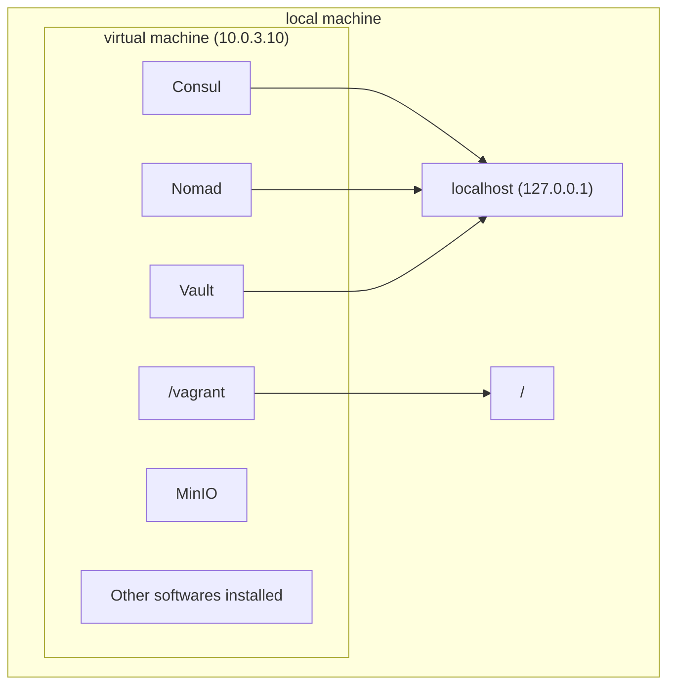

## The goal of this guide 

> :warning: Read the section `Description - what & why` in [README.md](/README.md) to get a quick introduction to what this repo is.

The goal of this guide is to give an introduction to the [vagrant hashistack box](https://vagrantcloud.com/fredrikhgrelland/hashistack), its features, and how to use it.

## What is the vagrant hashistack box
The vagrant-hashistack box is a virtual machine built with [vagrant](https://www.vagrantup.com/), using the code from [vagrant-hashistack](https://github.com/fredrikhgrelland/vagrant-hashistack/). It aims to simulate a hashistack ecosystem, and with the help of built in switches and services it is able to be tweaked to a user's needs. 

> :bulb: **Hashistack**, in current repository context, is a set of software products by [HashiCorp](https://www.hashicorp.com/).

In the context of this template the box solves the problem of setting up a hashistack ecosystem, which is normally tedious and non-trivial, but with the box does it's done with one click.  

### Vagrant box vs your local machine
It's important to note that your local machine and the running vagrant box (from now on called virtual machine) are two separate entities. The virtual machine is available at the IP `10.0.3.10` and our local machine is available at the IP `127.0.0.1`, or alternatively `localhost`.

TODO: generate PNG


### Services inside box
The virtual machine has four services running:

|Name|port|virtual machine|local machine|
|:---|:---:|:---|:---|
|Consul|8500|10.0.3.10:8500|localhost:8500|
|Vault|8200|10.0.3.10:8200|localhost:8200|
|Nomad|4646|10.0.3.10:4646|localhost:4646|
|MinIO|9000|10.0.3.10:9000|-|

As mentioned the virtual machine can be reached at `10.0.3.10`, meaning the services will be available at `10.0.3.10:<port-number>`. For convenience Consul, Vault, and Nomad have all been forwarded to `localhost` as well, meaning they are available at `localhost:<port-number>`. MinIO has _not_ been forwarded.  

### CLI-tools
Nomad, Vault and Consul have their own CLI-tools to interact with the servers that are running. They all default to `localhost`, and the default ports mentioned above.
This means you can download any of the binaries, and use them against the services inside the virtual machine. Refer to [Iteration of The Development process](./README.md#iteration-of-the-development-process) to see examples of how to use this.

### Using ansible
When working with this box we will use a technology called [ansible](https://www.ansible.com/). In short, ansible is a software that logs onto a computer like a normal user, and performs tasks defined in an ansible playbook (example [template_example/dev/ansible/playbook.yml](template_example/dev/ansible/playbook.yml). We will mostly be using this to interact with our virtual machine. In our case _all_ playbooks put inside [dev/ansible/](./dev/ansible/) will be run every time we start the box, and we will utilise this throughout the guide.

### Making artifacts available inside the box
As mentioned, the local and virtual machine are separate. To make something from our local machine (for example our code) available to the virtual machine we've got two options: 

#### 1. Synced folder
As mentioned earlier the virtual machine and local machine have a shared folder. In _all_ vagrant boxes the folder in which the `Vagrantfile` lies will be linked to `/vagrant` inside the box. In our case the `Vagrantfile` is in our root directory, the same as where this `getting_started.md` is.

#### 2. MinIO
Anything put in MinIO will be available to the virtual machine. Two methods are available to upload to MinIO: 

- 1. Upload files via the UI at `10.0.3.10:9000`. 
- 2. _All_ files put in the root directory (same as this file) will be automatically synced with MinIO

See [pushing docker image](/README.md#pushing-resources-to-minio-with-ansible-docker-image) and [fetching docker image](/README.md#fetching-resources-from-minio-with-nomad-docker-image) for examples on how to upload a docker image.
We will be using this later in the guide.


### Your First Running Virtual Machine
As a first step try running 

```bash
make up
```

in your terminal. This will start the provisioning of the virtual machine. Wait until it is finished. Voila, you got your very own hashistack running. Try going to `localhost:8500` in your browser, and you should see a Consul UI. The same goes for Nomad and Vault if you go to their ports, `4646` and `8200`. Next, let's log onto our virtual machine with

```bash
vagrant ssh
```

You are now inside the virtual machine. Let's go to our `/vagrant` folder and do an `ls`. Notice that it contains exactly the same folders and files as the folder this guide is in. This is because it is a [Synced folder](#1-synced-folder) like mentioned earlier. Try also running `terraform --help`, `nomad --help`, and `vault --help`, and you'll see that the CLI-tools have been downloaded to the virtual machine.
